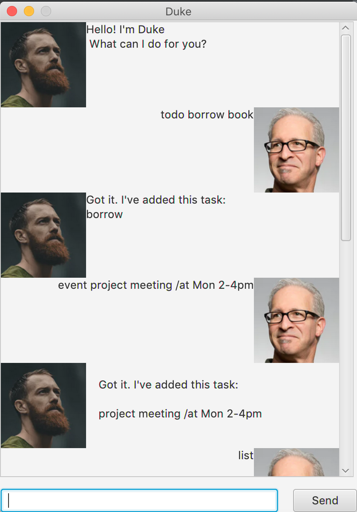

# User Guide
# Duke Personal Assistant
The Duke program implements an application that
a personal Assistant Chatbot that helps to keep track various of daily items.

## Setting up in Intellij

1. Open the project into Intellij as follows:
2. Configure the project to use **JDK 11** (not other versions) <br>
3. After that, locate the `src/main/java/Launcher.java` file, right-click it, and choose `Run Launcher.main()` (if the code editor is showing compile errors, try restarting the IDE). If the setup is correct, you should see something like the below as the output: <br>
   
   
## Quick Start
1. Ensure you have Java ```11 ``` or above installed in your computer.
2. Download the latest ```duke.jar ``` from [here](https://github.com/jr-mojito/ip/releases).
3. Copy the file to the folder you want to use as the home folder for your Duke Personal Assistant.
4. Open Command Prompt and type ```java -jar duke.jar``` to start the application.<br/>
5. Once application started, type the command in the input box and press ```Send``` to interact with Duke Personal Assistant.<br/>

## Features List
- [x] Add Todo
- [x] Add Event
- [x] Add Deadline
- [x] Add Event
- [x] Done
- [x] List
- [x] Delete
- [x] Find
- [x] Exit

## Feature 

### Add Todo ```todo ``` 
* tasks without any date/time attached to it
### Add Deadline ```deadline ```
* tasks that need to be done before a specific date/time
### Add Event ```event ```
* tasks that start at a specific time and ends at a specific time
### Done ```done ```
* Mark to for different task on the list
### List ```list ``` 
* List all added tasks
### Delete ```delete ```
* To delete a task in the list.
### List ```find ```
* Advance Search the task with the any partial keyword.
### Exit - Quit the Duke program


## Usage

### `Keyword` - Describe action

Describe the action and its outcome.

Example of usage:

* `todo borrow book`
* `event project meeting /at Mon 2-4pm`
* `deadline return book /by Sunday`
* `list`
* `done 1`
* `delete 1`
* `find meeting`


##Demo:

### Add Todo ```todo ``` 

Example Command:  **todo borrow book**

Duke replied:
```
    Got it. I've added this task:
    borrow book
```

### Add Event ```event ```

Format ```event <Decription> /at <Day> <Time>```

Example Command: 

**event project meeting /at Mon 2-4pm**

Duke replied:
```  
    Got it. I've added this task:
    project meeting /at Mon 2-4pm
```

### Add Deadline ```deadline ```
Format ```deadline <Decription> /by <Day>```

Example Command:

**deadline return book /by Sunday**

Duke replied:
```  
    Got it. I've added this task:
    return book /by Sunday
```

### List ```list ```

Example Command: **list**

Duke replied:
```
Here are the Task.
Task in your list:
    1. [✘][T]borrow book
    2. [✘][E] project meeting (at: Mon 2-4pm)
```

### Done ```done ```
Format: ```done <item no.> ```
* The ```<item no.>``` item need to be marked done.
* The ```<item no.>``` cannot be empty. 

Example Command: **done 1**

Duke Replied:
```
    Nice! I've marked this task as done:
    [✓][E] project meeting (at: Mon 2-4pm)
```

### Find ```find ```

Format: ```find <KEYWORD> ```
* The ```<KEYWORD>``` is the keyword to search.
* The ```<KEYWORD>``` cannot be empty.

Example Command: **find meeting**
